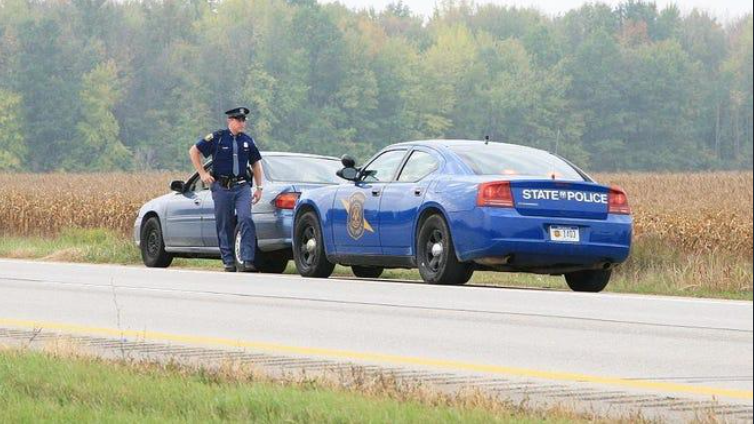
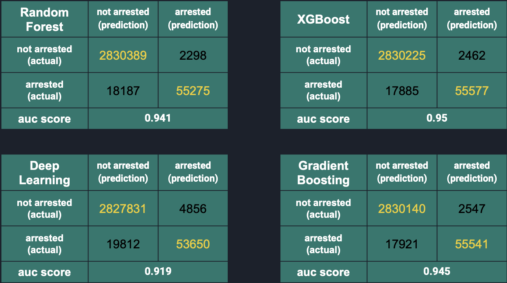

# Classification_on_arrests_of_traffic_violators_in_California
*Final project of Distributed Computing, USF MSDS program*

# Project Introduction

Traffic stops:a temporary detention of a driver of a vehicle by police to investigate a possible crime or minor violation of law.

The dataset is from https://www.kaggle.com/stanford-open-policing/stanford-open-policing-project-california

- Data Size: 2.32 GB
- 22 features+1 label
- 14,536,338 observations
- Covers all the stop data of California in 2013
 
 

 
 
# Analytics Goals

Final goal: Predict whether the violated driver or pedestrian will be arrested?

4 machine learning algorithms:

- Random Forest
- Gradient Boosting 
- DeepLearning
- XGBoost

# Data Pipeline

- Step1: Store data in AWS S3 Bucket
- Step2: Reading from S3, preprocess data using Pyspark on AWS EMR
- Step3: Write processed data parquet ready for model fitting back to S3
- Step4: Machine Learning on AWS EMR

 # Model and Results
 
 
